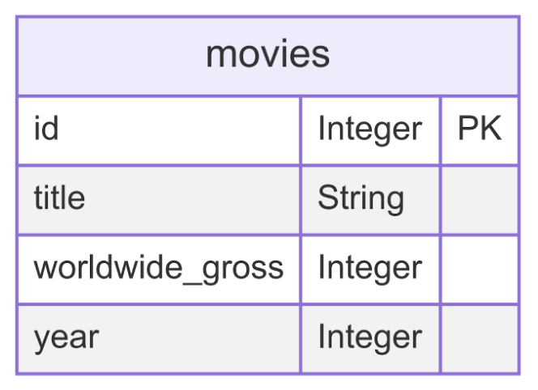

# Assignment #9 - Wikipedia Web Scraping

**TASK**: Create a Python program that scrapes the top 50 grossing movies of all time from the the [Highest Grossing Films of All Time](https://en.wikipedia.org/wiki/List_of_highest-grossing_films) Wikipedia page. The data that is scraped should be a list of dictionaries structured similar to the list below.

```python
[
    {"title": "Avatar", "worldwide_gross": 2923706026, "Year": 2009},
    {"title": "Avengers: Endgame", "worldwide_gross": 2797501328, "Year": 2019},
    # ...many more movies
]
```

Once the data has been extracted, the scraped data should then be stored in a `movies.db` database. The `movies` database has a `movies` table with the entity diagram shown below.



Your final code should have the following functions:
- `def scrape_wikipedia()`: This function should 
    - Send a `GET` request to the [Highest Grossing Films of All Time](https://en.wikipedia.org/wiki/List_of_highest-grossing_films) webpage.
    - Grab all rows stored in the table with a class of `"wikitable"`
    - Parse the returned data and use regex to remove additional text on the grosses. For example, the `$` and `,` should be removed from all the worldwide gross data so that it can be added to the database as an integer.
    - Create a dictionary of the cleaned data similar to the format:
    ```python
    {'title': 'Avatar', 'worldwide_gross': 2923706026, 'year': '2009'} 
    ```
    - Finally, return a list of dictionaries that contains all the data that was scraped from the wikipedia table

## Grading Your Work
This assignment can grade itself! To setup the autograding, you should do the following:
1. Clone this file to your local machine using the command
```bash
git clone PASTE_URL_HERE
```
2. Open the downloaded file in your VS Code editor.
3. In the left hand sidebar, press the "Testing" menu represented by the picture of a flask.
4. Click "Configure Python Tests".
5. You'll have two options to select. Select **pytest**.
6. Select the folder where the tests live. You can simply select `. Root directory`.
7. You can now run the tests by pressing the play icon. A passing test will get a ✅ and a failing test will get a ❌.
8. Run the tests as you code and by the end it should be all ✅ if you have followed the specifications for this assignment!

## Unit Test Explanations

Below is a summary of what each unit test for this assignment is checking for.

### Database Tests
- `test_movies_table_exists`: Verifies that the users table exists in the database.
- `test_movies_table_columns`: Verifies the schema of the movies table.
- `test_database_size`: Tests that at least 10 values have been added to the `movies` table in `movies.db`.

### `scrape_wikipedia` Tests
- `test_scrape_wikipedia_returns_list`: Tests that the `scrape_wikipedia` function returns a list of dictionaries.
- `test_movie_data_structure` : Test that each movie dictionary returned by `scrape_wikipedia` has the correct keys and value types.
- `test_specific_movies_present`: Test that some well-known highest-grossing movies ( 'Avatar', 'Avengers: Endgame', 'Titanic', 'The Lion King', and 'Jurassic Park') are returned by `scrape_wikipedia`.
- `test_worldwide_gross_formatting`: Tests that worldwide gross values returned by `scrape_wikipedia` are properly cleaned and converted to integers.